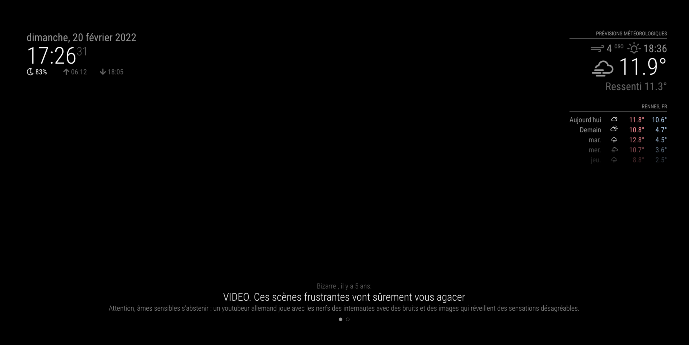
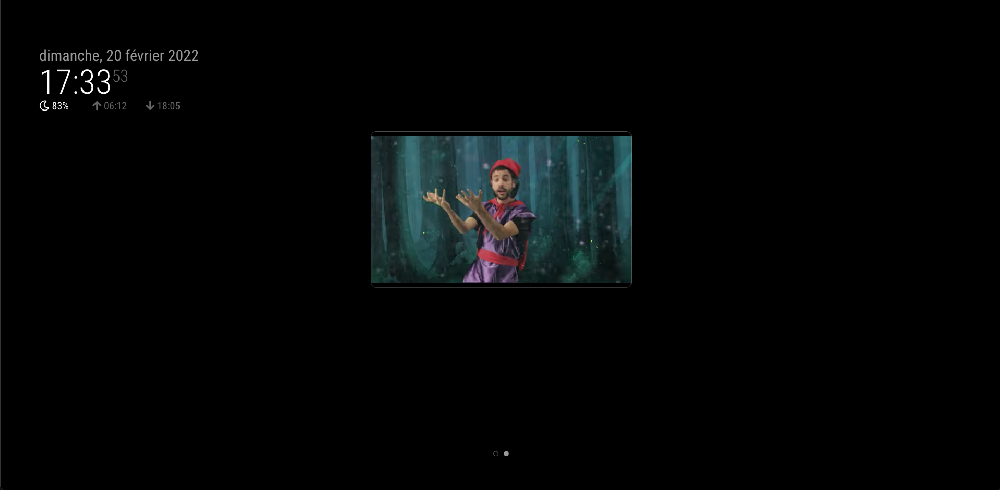

# MagicMirror2 Module: MMM-FTP-image

```sh
  __  __ __  __ __  __       ____                       ____                                         _
 |  \/  |  \/  |  \/  |     |  _ \ __ _  __ _  ___     / ___|  ___ _ __ ___  ___ _ __   ___ __ _ ___| |_
 | |\/| | |\/| | |\/| |_____| |_) / _` |/ _` |/ _ \____\___ \ / __| '__/ _ \/ _ \ '_ \ / __/ _` / __| __|
 | |  | | |  | | |  | |_____|  __/ (_| | (_| |  __/_____|__) | (__| | |  __/  __/ | | | (_| (_| \__ \ |_
 |_|  |_|_|  |_|_|  |_|     |_|   \__,_|\__, |\___|    |____/ \___|_|  \___|\___|_| |_|\___\__,_|___/\__|
                                        |___/
```

## Required

The [MMM-pages](https://github.com/edward-shen/MMM-pages) module with [MMM-page-indicator](https://github.com/edward-shen/MMM-page-indicator) for show page index.
And [MMM-Screencast](https://github.com/kevinatown/MMM-Screencast) module.

## Description

This [MagicMirror2](https://github.com/MichMich/MagicMirror) module is an interface module between the module [MMM-pages](https://github.com/edward-shen/MMM-pages) and [MMM-Screencast](https://github.com/kevinatown/MMM-Screencast).
It allows you to automatically change the page to the page where the MMM-Screecast module is located, allowing you to cast a video on the magic mirror

## Screenshots

Home page ⤵️



Screencast page switch auto ⤵️



## Installation

Open your terminal in your MagicMirror project and ⤵️

1. Go to your MagicMirror's **module folder**:

```sh
$ cd ~/MagicMirror/modules
```

2. Clone this module

```sh
$ git clone https://github.com/jboucly/MMM-pages-screencast.git
```

3. Enjoy ! 🚀

## Configurations

To use this module, add it to the modules array in the `config/config.js` file:

```javascript
modules: [
  {
    module: "MMM-Pages-Screencast",
    config: {
      homePage: 0,
      castPage: 1
    }
  }
];
```

## Configuration options

The following properties can be configured:

| Options  | Required | Default | Description                                                |
| -------- | :------: | :-----: | ---------------------------------------------------------- |
| homePage |  false   |    0    | Home page of MMM-pages module                              |
| castPage |  fasle   |    1    | The page where the module is located MMM-Screencast module |
